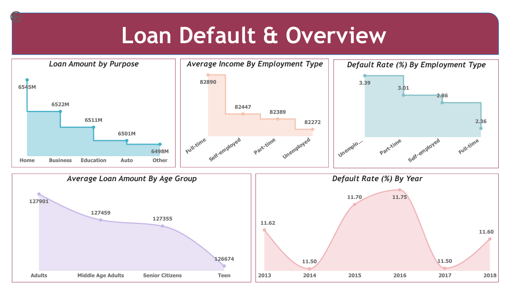
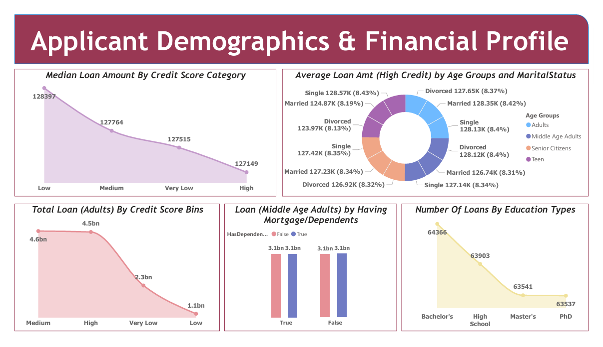
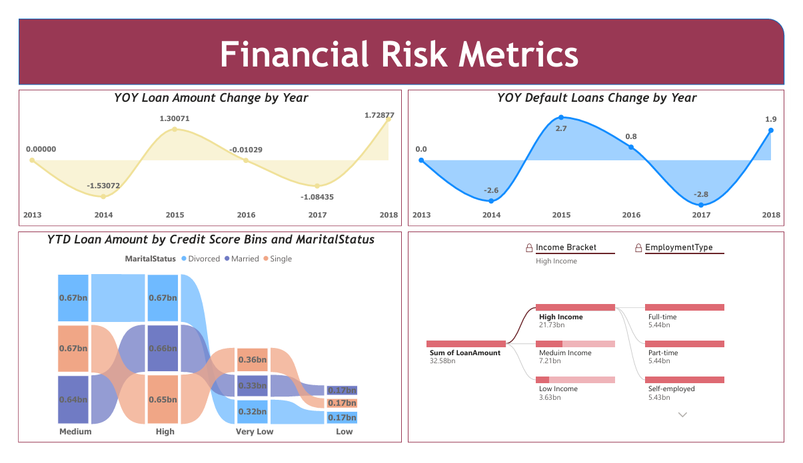

# Loan_Default_Analysis (Data Source : DataFlow)

## 1. Overview  
The **Loan Default Analysis** project aims to understand borrower behavior and identify the factors that contribute to loan default. Using Power BI, Dataflows, SQL Server, and Excel, this project builds an end-to-end analytics pipeline that ingests, processes, and visualizes large-scale loan data (2.5 lakh+ rows).  
The final dashboard highlights demographic patterns, financial risk indicators, and trends to support data-driven decision-making for lenders.

---

## 2. Business Problem  
Financial institutions face major challenges in reducing loan default risk. Without identifying high-risk borrower segments or understanding repayment behavior, lenders may face:

- Revenue loss due to unpaid loans  
- Ineffective risk scoring models  
- Poor targeting strategies for lending products  
- Difficulty in monitoring portfolio health over time  

This project provides insights into:  
✔ Key borrower segments with high default risk  
✔ How credit score, income, employment, and demographics affect loan repayment  
✔ Year-over-year default trends  
✔ Financial indicators that help shape lending strategy  

---

## 3. Dataset Overview  

The **Loan Default Dataset** contains information about borrowers who applied for loans, including demographic details, financial metrics, loan characteristics, and repayment outcomes.

- **Total Rows:** ~2,50,000+  
- **Columns Included:**
```
Column_Definitions.csv
```

---

## 4. Tools & Technologies

### **Data Pipeline Tools**
- Excel  
- Microsoft SQL Server  
- Power BI Dataflows (Gen1)  
- On-premises Standalone Data Gateway  

### **Visualization & Modeling**
- Power BI Desktop  
- Power BI Service (Workspace: *dataflow_13*)

---

## 5. Approach

### **Data Pipeline Flow**
- Excel File → (Load Data) → MS SQL Server
- MS SQL Server → (Source) → Power BI Dataflow Gen1
- Power BI Service (Workspace) → Power BI Desktop (for analysis)


### **Steps Followed**
1. Used **Power BI Dataflows** as the primary managed data source.  
2. Configured a **Standalone Gateway** to allow data refresh and multi-team collaboration.  
3. Loaded raw data into **Microsoft SQL Server**.  
4. Connected SQL tables to **Dataflow Gen1** inside the *dataflow_13* workspace.  
5. Processed & stored data inside Power BI Service.  
6. Imported the dataflow into **Power BI Desktop** to build the final dashboards.

---

## 6. Key Insights

### **📌 Page 1 — Loan Default & Overview**


#### **Loan Amount by Purpose**
- Loan distribution is uniform across Home, Business, Auto, Education, and Other purposes (~6500M each).  
- No purpose dominates the loan portfolio.

#### **Average Income by Employment Type**
- Income levels are similar across Full-time, Part-time, Self-employed, and Unemployed groups.

#### **Default Rate by Employment Type**
- **Unemployed borrowers have the highest default rate (3.39%).**  
- Part-time employees have the lowest (2.36%).

#### **Average Loan Amount by Age Group**
- Loan amounts remain consistent (~126K–128K) across all age segments.

#### **Default Rate by Year**
- Default rates are stable (11.50–11.75%) from 2013 to 2018.

---

### **📌 Page 2 — Applicant Demographics & Financial Profile**


#### **Median Loan Amount by Credit Score Category**
- Loan amounts range narrowly from 127K–128K across all credit score groups.

#### **Loan Amount by Age Group & Marital Status (High Credit Borrowers)**
- Married borrowers with high credit scores tend to take slightly higher loan amounts.  
- Single and divorced borrowers show similar patterns.

#### **Total Loan (Adults) by Credit Score**
- Medium and High credit groups dominate the adult loan portfolio.  
- Very Low credit borrowers still receive significant loan volume, indicating risk exposure.

#### **Loans by Mortgage & Dependents (Middle Age Adults)**
- Loan amounts are identical regardless of dependents or mortgage status.

#### **Loans by Education**
- Nearly equal loan distribution among Bachelor's, Master's, High School, and PhD holders.

---

### **📌 Page 3 — Financial Risk Metrics**


#### **YOY Loan Amount Change**
- Growth spikes in **2014** and **2016**.  
- Declines in **2015** and **2017**.

#### **YOY Default Change**
- Defaults increased sharply during 2014–2015.  
- Dropped significantly during 2016–2017.

#### **YTD Loan Amount by Credit Score & Marital Status**
- Married borrowers across all credit score groups contribute the highest loan volume.

#### **Income Bracket Distribution**
- **High-income borrowers contribute the largest share (32.58bn).**  
- Medium-income: 21.73bn  
- Low-income: 7.21bn  
- Very low-income: 3.63bn  

#### **Loans by Employment Type**
- Loan amounts are nearly identical across Full-time, Part-time, and Self-employed groups (~5.4bn each).

---

## 7. Final Conclusion

The Loan Default Analysis reveals strong patterns useful for financial decision-making:

### **Key Findings**
- Highest default risk is observed among **unemployed** and **low credit score** borrowers.  
- Loan amounts remain consistent across demographics, suggesting standardized lending policies.  
- High-income and married borrowers form the majority of the loan portfolio.  
- Default rates are stable over time but show short-term fluctuations.  
- Dependents, mortgages, and education level do **not** significantly influence loan amount distribution.

---


